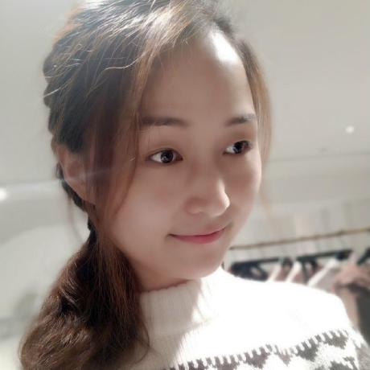

I am a software engineer at Tencent.

I study agents.

<!--I dedicate 30 minutes per week to chat with students. Just paper plane me!  -->

# Selected work

# Online talks

# Recent readings

- Lectures on General Relativity (David Tong)
- What Babies Know (Elizabeth Spelke)
- The Art of Doing Science and Engineering (Richard Hamming)
- A Simpler Life (The School of Life)
- Elon Musk (Walter Isaacson)
- The Search (John Battelle)
- Leadership: In Turbulent Times (Doris Kearns Goodwin)
- 置身事内 （兰小欢）

(last updated: Jul 2026)
